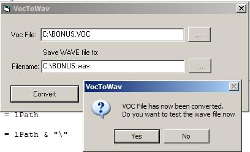



## Voc2Wave

### Description

This code shows how to convert 8-bit Creative Labs Sound sound files to Wave Format so you can play them tho VB, anyway all pure vb code been used, also some test examples, hope you liek it.
 
### More Info
 

             |
---                |---
**Submitted On**   |2007-01-25 04:41:20
**By**             |[dreamvb](https://github.com/Planet-Source-Code/PSCIndex/blob/master/ByAuthor/dreamvb.md)
**Level**          |Intermediate
**User Rating**    |5.0 (25 globes from 5 users)
**Compatibility**  |VB 3\.0, VB 4\.0 \(16\-bit\), VB 5\.0, VB 6\.0
**Category**       |[Sound/MP3](https://github.com/Planet-Source-Code/PSCIndex/blob/master/ByCategory/sound-mp3__1-45.md)
**World**          |[Visual Basic](https://github.com/Planet-Source-Code/PSCIndex/blob/master/ByWorld/visual-basic.md)
**Archive File**   |[Voc2Wave2044801252007\.zip](https://github.com/Planet-Source-Code/dreamvb-voc2wave__1-67737/archive/master.zip)

